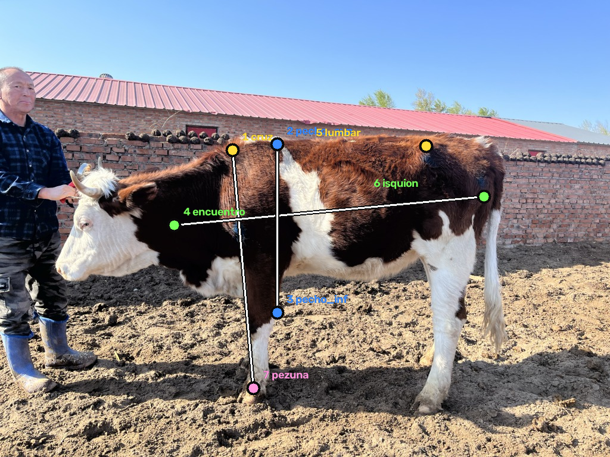

# Guía de etiquetado — 7 landmarks anatómicos

**Leer entero antes de marcar la primera imagen.** Somos cuatro etiquetando: si cada
uno interpreta un punto distinto, el modelo aprende esa inconsistencia como ruido y
no hay arquitectura que lo arregle después.



## Los 7 puntos, en orden

El orden importa: YOLO-pose los identifica por índice, no por nombre.

| # | Nombre | Dónde va exactamente |
|---|---|---|
| 1 | `cruz` | Punto más alto de la cruz, **sobre el borde del lomo**, justo donde termina el cuello y empieza la espalda |
| 2 | `pecho_sup` | Sobre el borde del lomo, **inmediatamente detrás de la cruz**. Es el arranque superior del perímetro torácico |
| 3 | `pecho_inf` | Borde inferior del pecho, **justo detrás del codo**, en la vertical de `pecho_sup` |
| 4 | `encuentro` | Punta del hombro: el punto **más adelantado** del pecho, donde el cuello se une al tronco |
| 5 | `lumbar` | Punto más alto de la grupa, sobre el borde del lomo, encima del hueso de la cadera |
| 6 | `isquion` | Punta de nalga: el punto **más atrasado** del cuerpo, en el borde posterior de la grupa |
| 7 | `pezuna` | Apoyo de la **pata delantera** en el suelo, donde la pezuña toca la tierra |

## Las tres medidas que salen de estos puntos

```
altura a la cruz     = distancia(1 cruz, 7 pezuna)
largo corporal       = distancia(4 encuentro, 6 isquion)
profundidad torácica = distancia(2 pecho_sup, 3 pecho_inf)
```

La profundidad torácica es la que más pesa: correlaciona 0,95 con el peso, mejor que
el propio perímetro torácico. Si hay un punto que conviene marcar con cuidado, son
el 2 y el 3.

## Reglas que evitan el 90% de las inconsistencias

**Marcar sobre el borde del animal, no adentro.** Los puntos 1, 2, 3, 5 y 6 van
sobre la silueta, no sobre el cuerpo. El error más común es poner el punto "cerca"
en vez de exactamente en el borde.

**Los puntos 2 y 3 tienen que estar en la misma vertical.** Marcá primero el 2 sobre
el lomo, después bajá derecho hasta el borde inferior del pecho para el 3.

**Siempre la pata delantera más cercana a la cámara** para el punto 7. Si las dos
están visibles, usá la que esté del lado del observador.

**Si un punto está tapado, estimalo igual.** Si la mano del que sostiene al animal
tapa el encuentro, marcá dónde estaría. No dejes puntos sin marcar: un keypoint
faltante vale menos que uno aproximado.

**Cabeza abajo no cambia nada.** Varios animales del dataset están pastando. Los 7
puntos son del tronco y las patas, ninguno depende de la cabeza — por eso elegimos
estos y no el contorno completo.

**No importa para qué lado mira el animal.** El modelo se entrena con volteo
horizontal y los 7 puntos conservan su identidad al espejar (no hay pares
izquierda/derecha entre ellos).

## Herramienta

CVAT o Roboflow, plan gratuito. Crear un proyecto de **keypoints con 7 puntos**,
un solo objeto (`bovino`) por imagen, y exportar en formato **YOLO pose**.

Las 72 imágenes están en `imagenes/`, ya reducidas a 1024 px de ancho.

## Reparto sugerido

18 imágenes cada uno. Antes de repartir, **etiquetar juntos las primeras 5** y
comparar: es la forma más barata de detectar que uno está interpretando un punto
distinto. Cinco minutos ahí ahorran tener que reetiquetar las 72.
